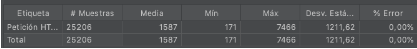
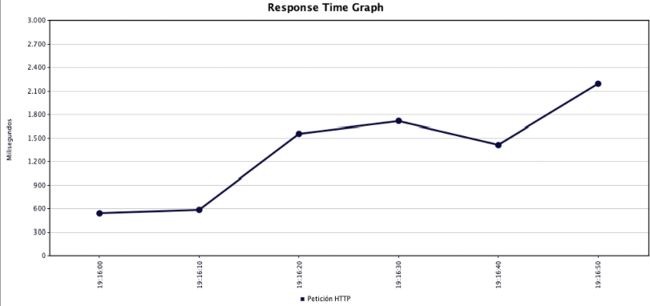
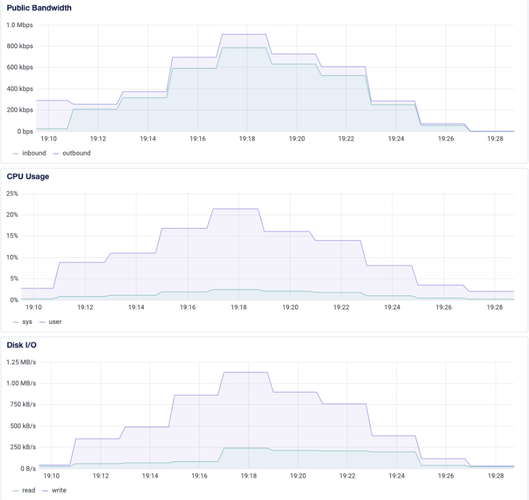
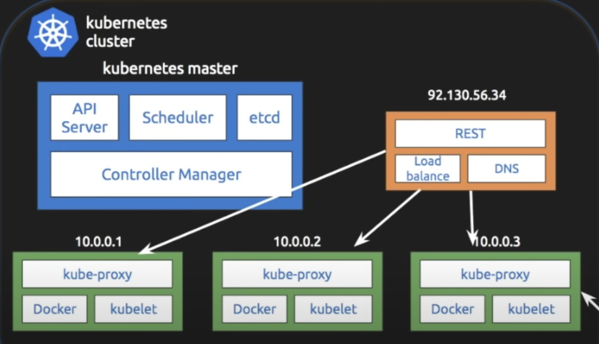
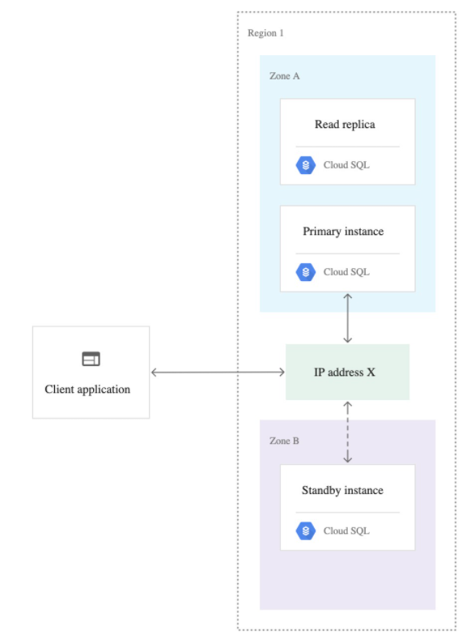
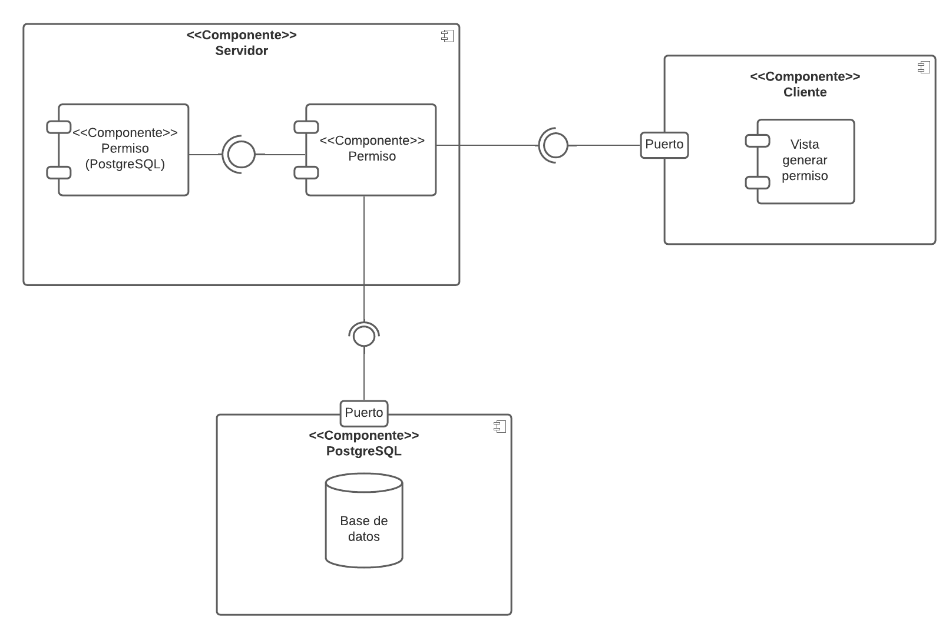

# Pep 1 Distribuidos

## Descripción del sistema implementado

El sistema desarrollado fue diseñado bajo una arquitectura Cliente - Servidor. En el lado del cliente se ejecuta un Front-End realizado con VueJs, por otra parte, en el lado del servidor se tiene un Back-End implementado en Spring realizando el trabajo de una API Rest con una base de datos PostgresSQL.

El sistema permite ingresar datos en un formulario para simular la obtención de un permiso como lo es en el sitio de “Comisaría Virtual”, además es posible verificar la fecha del permiso generado para obtener su validación.

## Descripción del Servidor utilizado para las pruebas.

Con el propósito de reconocer el funcionamiento del sistema bajo alta demanda de peticiones se han tenido que realizar pruebas de estrés sobre el mismo, por lo cual es importante conocer el sistema con el cual se ha trabajado y tenido de referencia.

Servidor: 1 CPU, 1 GB RAM, 25 GB SSD.

## Principales características de un sistema distribuido

### Disponibilidad

El sistema debe tener disponible los recursos de manera permanente. En la mayoría de los casos, se utiliza la replicación para asegurar que los datos siempre estarán disponibles para el usuario.

### Transparencia de la distribución

La definición de transparencia en un sistema distribuido es la ocultación al usuario que los componentes de este sistema distribuido están separados. Por lo tanto, el usuario percibirá que el sistema es un todo y no varios componentes separados. Esta transparencia está separada en: acceso, ubicación, migración, re-localización, replicación, concurrencia y fallas.

### Apertura

Un sistema distribuido abierto es aquel que puede ofrecer servicios bajo reglas estándar (sintaxis y semántica). Permitiendo interoperabilidad, portabilidad y fácil extensión.

### Escalabilidad

Existen dos formas de escalabilidad, la horizontal, que implica que un sistema que crece en número de nodos de trabajo aumentando la cantidad de los recursos. También está la escalabilidad vertical que es aumentar la capacidad de los recursos, que se logra mejorando lo actual sin necesidad de agregar algo extra.

## Analisis de caracteristicas del sistema implementado

### Transparencia

- **Acceso**: Al trabajar con el módulo de Spring data, es posible abstraerse de la ubicación de la base de datos, por lo cual no importa donde esta se encuentre, es posible acceder a los datos tanto de forma local como remota.
- **Ubicación**: El recurso no se encuentra disponibilizado bajo un dominio web utilizando el protocolo DNS, por lo cual no se cumple con esta característica.
- **migración**: La migracion del sistema es posible debido a uso de contenedores a traves de Docker.
- **re-localización**: Como de momento no se está utilizando el protocolo DNS mencionado anteriormente, el sistema no cuenta con una re-localización apta debido al manejo de IPs que se tiene que efectuar.
- **Replicación**: El recurso no se encuentra replicado por lo tanto no cumple esta características. Sin embargo, al estar corriendo sobre contenedores, es posible crear réplicas y utilizar un balanceador para que sea transparente por el usuario.
- **Concurrencia**: Spring tiene la capacidad de manejar múltiples solicitudes de forma concurrente a través de hilos, por lo cual, es posible que haya más de un usuario utilizando el recurso sin notarlo.
- **Fallas**: Si alguno de los componentes falla (Front-End, Back-End o Base de datos) sería visible para el usuario, ya que el sistema quedaría inutilizable en alguno de estos casos al no contar con réplicas.

### Escalabilidad

- **Horizontal**: El sistema no posee una escalabilidad horizontal, sin embargo, esta característica se vuelve implementable debido a la utilización de contenedores. Con Kubernetes es posible utilizar la imagen de un contenedor para crear réplicas de esta que sean dinámicamente escalables en función de la demanda en el sistema.
- **Vertical**: Ya que el sistema está montado sobre contenedores, es posible modificar la asignación de recursos en estos para obtener un mejor rendimiento de la aplicación cuando sea necesario. Además, el servidor está montado en un droplet de Digitalocean, al cual es posible cambiar las características de su hardware cuando sea necesario sin alterar el contenido de este.

### Disponibilidad

En el estado actual del sistema, no es altamente disponible. Esto debido a que no existe un mecanismo de replicación de los datos. Si se llegan a perder los datos, no hay forma de ponerlos a disposición de manera rápida. Aun así, existen opciones para bases de datos PostgreSQL que permiten la replicación, que están basados en Triggers o ficheros WAL. Se considerará su implementación para mejorar el sistema.

### Apertura

El sistema si posee apertura, debido a que se encuentra implementado bajo una arquitectura de API REST utilizando spring boot framework para esto, por lo cual posee un acceso a sus servicios bajo reglas estándar, cumpliendo con la interoperabilidad, portabilidad y fácil extensión.

## TEST

Se realiza un test de inserción de datos sobre sobre el servicio de registrar un permiso.
Para este test se utilizó la herramienta de JMeter para simular una request de 1000 usuarios paralelos durante 60 segundos, en la cual los primeros 20 segundos son utilizados para ir incrementando el número de usuarios concurrentes de 0 a 1000.

- **Tabla de resumen**:

- **Grafico tiempo de respuesta**:

Como se puede observar en el gráfico, durante los primeros instantes del test cuando los usuarios concurrentes comenzaban a aumentar, el tiempo de respuesta se aproximaba a los 600 ms, sin embargo, a la medida que incrementaba esta cantidad de usuarios, el tiempo de respuesta también aumentó alcanzando a ser de más de 2 segundos.

Uso de recursos en el servidor durante el test:

# Pep 2

Ahora, en base a lo descrito en la prueba de Sistemas Distribuidos anterior. Se escogen ciertas propiedades de la teoría para implementar y mejorar el sistema implementado. Las propiedades que no se cumplieron anteriormente, ya sea completa o parcialmente, fueron:

- Transparencia: Ubicacion
- Transparencia: Re-localizacion
- Transparencia: Replicacion
- Transparencia: Fallas
- Escalabilidad: Horizontal
- Disponibilidad

Para cada una de las características que no cumple el sistema, se sugieren algunos cambios para solventar

- Transparencia (Ubicación): Actualmente, el sistema no cuenta con un dominio para el protocolo DNS, es decir, para acceder al sitio se necesita utilizar la Ip y el puerto del servidor donde se encuentra. Para este punto, se sugiere obtener un dominio y poner un nombre propio al sistema para que los clientes puedan acceder a través del protocolo DNS en la barra de navegación o un motor de búsquedas.

- Transparencia (Re-localización): Esta característica va de la mano con la ubicación, se necesita un protocolo DNS para solventar la re-ubicación, si llega a haber un cambio de servidor para el sitio web, será totalmente transparente para el cliente utilizando un dominio conocido.

- Transparencia (Replicación): Para que se cumpla, debe existir datos replicados en primer lugar. No se puede esconder una replicación si no existe. En este sentido se puede implementar instancias de google cloud que se detallan en disponibilidad.

- Transparencia (Fallas): Se puede solventar utilizando google cloud, con el sistema de replicacion con postgreSQL (que también permite disponibilidad). De esta forma, si el servidor presenta una falla, puede ser automáticamente redireccionado a uno auxiliar y la falla podría ser invisible para el usuario.

- Escalabilidad (Horizontal): La escalabilidad horizontal se puede solventar con el uso de Kubernetes, al tener empaquetada la aplicación y utilizando contenedores. Es posible tener replicar estos contenedores y generar un balanceo de cargas gracias a la automatización que ofrece Kubernetes. 

- Disponibilidad: Para solventar la disponibilidad que pueda ofrecer el sistema distribuido, se puede utilizar una replicación de los datos guardados en la base de datos. De esta forma, si el sistema llega a presentar alguna falla con respecto a los datos presentes, se puede acudir a su réplica para tener los recursos siempre disponibles al usuario. Lo que se sugiere, es utilizar google cloud. Al tener el sistema en el sistema de nubes de google se puede utilizar lo que se conoce como instancias de Cloud SQL. La configuración que ofrece google para ofrecer alta disponibilidad es la de clusters, donde existen instancias del back-end que están en una primaria y una de espera. En el caso que exista una falla en una instancia, la configuración de google reduce el tiempo de inactividad y los datos seguirán disponibles para el cliente.

## Cambios realizados 

Los cambios implementados satisfacen las siguientes características:

- **Transparencia: Replicación**
- **Escalabilidad: Horizontal**
- **Disponibilidad**
- **Transparencia (Fallas)**
- **Transparencia (Ubicacion)**

Se suben los contenedores disponibles del sistema distribuido a la plataforma de nubes de google (Google Cloud Platform) específicamente se utiliza el engine de Google Kubernetes. Este cuenta con 3 nodos y un balanceador de cargas para el sistema distribuido. Por otra parte, se configura la replicación que se ofrece la PostgreSQL que permite la disponibilidad a través de réplicas para instancias de Cloud SQL. Esto se hace mediante la redundancias de datos con instancias de espera. 

- Escalabilidad (Horizontal): Se cubre con el uso del kubernetes engine que permite escalabilidad horizontal gracias a los nodos disponibles, como también del balanceador de cargas que ofrece.

Disponibilidad: Se ofrece mediante el uso de instancias de Cloud SQL de Google Cloud Platform y el uso de nodos para los contenedores del back, de esta forma si se pierde una instancia primaria, se usa una replicación para mantener disponibles los recursos al cliente.

Transparencia (Replicación): Ahora el sistema cuenta con replicación y es totalmente transparente para el usuario.

Transparencia (Fallas): Nuevamente, al tener el sistema distribuido en distintos nodos e instancias. Es posible que las fallas del sistema sean transparentes al usuario en caso que exista una falla.

Transparencia (Ubicacion): Ahora el servidor tiene un dominio propio mejorcomisaria.tk, por lo tanto, es de facil acceso para los clientes de la aplicacion web.

